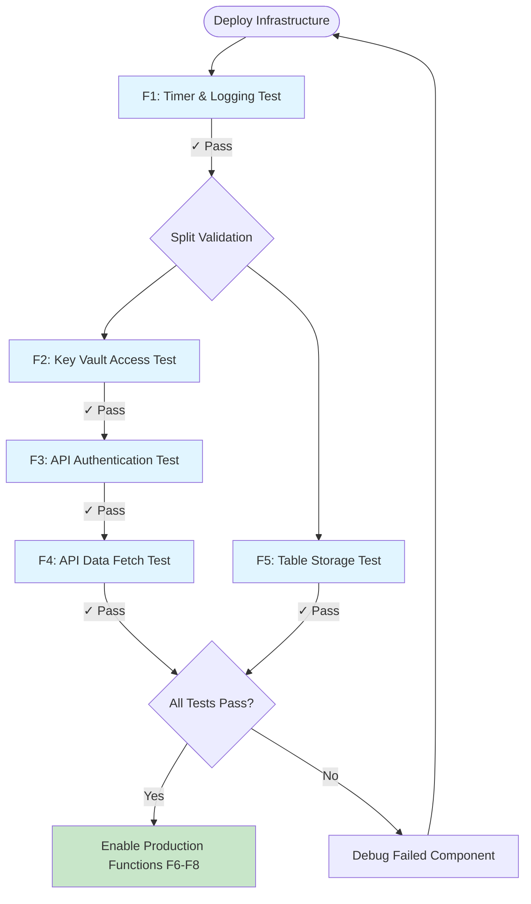
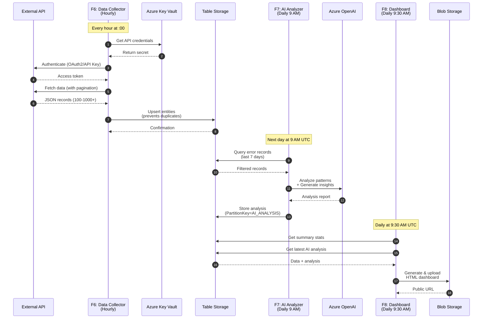
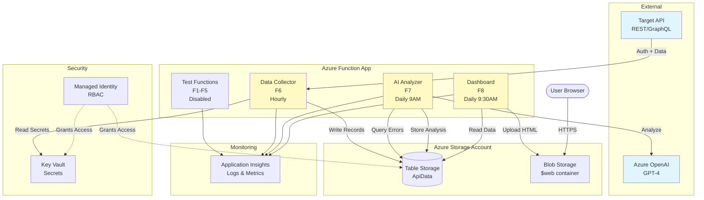
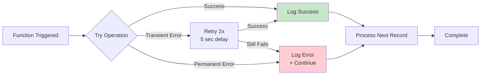
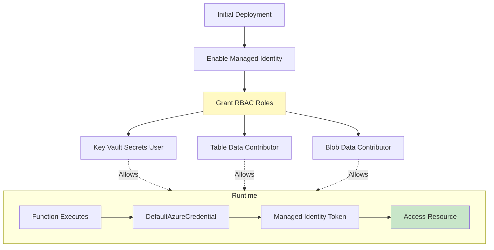
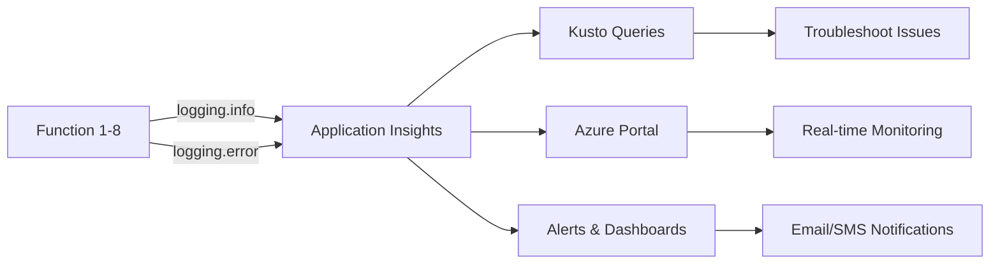

# Data Flow Documentation

This document explains how data flows through the API Observability Framework.

---

## Overview

The framework uses **progressive validation** to ensure each capability works before enabling production workloads. Data flows through three phases:

1. **Validation Phase** - Test functions (F1-F5) validate infrastructure
2. **Collection Phase** - Production collector (F6) fetches and stores data
3. **Analysis Phase** - AI analyzer (F7) and dashboard (F8) generate insights

---

## 1. Progressive Validation Flow

Test functions run **once during setup** to validate each component independently.



### Validation Dependencies

| Function | Tests | Depends On | Duration |
|----------|-------|------------|----------|
| F1 | Timer triggers + logging | None | 5 min |
| F2 | Key Vault RBAC | F1 | 10 min |
| F3 | API authentication | F2 | 10 min |
| F4 | API data retrieval | F3 | 10 min |
| F5 | Table Storage write/read | F1 | 10 min |

**Total validation time:** ~45 minutes

---

## 2. Production Data Flow

Production functions run **automatically on schedule** after validation.



### Data Collection Process (F6)

**Input:** API credentials from Key Vault  
**Output:** Deduplicated records in Table Storage

1. **Authenticate** - Retrieve credentials, obtain API token
2. **Paginate** - Fetch records in batches (100-1000 per page)
3. **Transform** - Map API fields to storage schema
4. **Upsert** - Insert new or update existing records (prevents duplicates)
5. **Log** - Record stats (new/updated counts)

**Deduplication:** Uses API's unique ID field as `RowKey` - same ID = update, not duplicate.

---

## 3. Component Architecture

Shows how Azure resources interact.



### Component Roles

| Component | Purpose | Access Method |
|-----------|---------|---------------|
| **Function App** | Serverless compute | Managed Identity |
| **Key Vault** | Store API credentials | RBAC (Secrets User) |
| **Table Storage** | Store API records | RBAC (Table Data Contributor) |
| **Blob Storage** | Host HTML dashboard | RBAC (Blob Data Contributor) |
| **App Insights** | Centralized logging | Connection String |
| **Azure OpenAI** | AI analysis | API Key |

---

## 4. Data Schema

### Table Storage Entity Structure

```json
{
  "PartitionKey": "api_data",
  "RowKey": "unique-id-from-api",
  "EventTimestamp": "2025-10-20T10:30:00Z",
  "Status": "Success",
  "Message": "Operation completed",
  "fetched_at": "2025-10-20T11:00:00Z",
  ...custom fields from FIELD_MAPPING
}
```

**Key Fields:**
- `PartitionKey` - Grouping strategy (static or category-based)
- `RowKey` - Unique identifier (prevents duplicates)
- `fetched_at` - When record was collected
- Custom fields - Mapped from API response via `FIELD_MAPPING`

### AI Analysis Storage

```json
{
  "PartitionKey": "AI_ANALYSIS",
  "RowKey": "2025-10-20T09:00:00Z",
  "analysis": "Full AI-generated report text",
  "records_analyzed": 150,
  "generated_at": "2025-10-20T09:00:00Z"
}
```

---

## 5. Error Handling & Retry Logic



**Retry Configuration** (in host.json):
- Strategy: Fixed delay
- Max retries: 2
- Delay: 5 seconds

**Partial Success:** If 1 record fails out of 1000, the other 999 still get stored. Errors logged but don't stop processing.

---

## 6. Timing & Schedules

```mermaid
gantt
    title Daily Execution Schedule (UTC)
    dateFormat HH:mm
    axisFormat %H:%M
    
    section Hourly
    Data Collection (F6) :crit, 00:00, 1h
    Data Collection (F6) :crit, 01:00, 1h
    Data Collection (F6) :crit, 02:00, 1h
    
    section Daily Analysis
    AI Analyzer (F7) :active, 09:00, 30m
    Dashboard Gen (F8) :active, 09:30, 10m
```



**Production Schedule:**
- **F6 (Data Collector):** `0 0 */1 * * *` (every hour at :00)
- **F7 (AI Analyzer):** `0 0 9 * * *` (daily at 9:00 AM UTC)
- **F8 (Dashboard):** `0 30 9 * * *` (daily at 9:30 AM UTC)

**Why this timing?**
- F7 runs after 24 hours of F6 collections (enough data to analyze)
- F8 runs 30 min after F7 (ensures analysis is ready)

---

## 7. Security Data Flow



**Security Flow:**
1. Function app has system-assigned managed identity (like a service account)
2. RBAC roles grant identity access to resources
3. At runtime, `DefaultAzureCredential()` automatically uses managed identity
4. No connection strings or keys in code

**Zero Secrets in Code:**
- API credentials → Key Vault
- Storage access → Managed Identity (RBAC)
- OpenAI key → Environment variable (not in code)

---

## 8. Monitoring & Observability

All functions log to Application Insights:



**Query Examples:**

```kusto
// View all function executions (last hour)
traces
| where timestamp > ago(1h)
| where message contains "PRODUCTION"
| project timestamp, message

// Find errors
traces
| where severityLevel == 3
| where timestamp > ago(24h)
| project timestamp, message, customDimensions

// Track data collection stats
traces
| where message contains "Stored"
| project timestamp, message
| order by timestamp desc
```

---

## 9. Disaster Recovery

**Data Loss Prevention:**
- Table Storage has built-in replication (3 copies)
- Upsert logic prevents duplicate processing
- Failed records logged but don't stop batch

**Recovery Scenarios:**

| Scenario | Impact | Recovery |
|----------|--------|----------|
| Function fails mid-batch | Partial data stored | Next run fetches all (upsert handles duplicates) |
| API rate limit hit | Collection incomplete | Retry after delay, pagination resumes |
| OpenAI quota exceeded | No analysis generated | Function logs error, retries next day |
| Storage account unavailable | No data written | Function retries 2x, then logs error |

---

## 10. Scaling Considerations

**Current Design:**
- Single function app (consumption plan)
- Handles ~10K records/hour comfortably
- AI analysis limited to 100 records for token efficiency

**Scale Limits:**
| Component | Current | Max Capacity | Scale Solution |
|-----------|---------|--------------|----------------|
| API calls | 1/hour | ~720/hour | Increase schedule frequency |
| Table Storage | Unlimited | Petabytes | Partition by date/category |
| Function timeout | 10 min | 10 min (consumption) | Move to premium plan (30 min) |
| AI analysis | 100 records | ~1000/request | Batch processing or premium model |

**When to Scale:**
- Records > 100K/hour → Use Premium Plan or split by region
- Analysis > 1000 records → Implement batch processing
- Multiple APIs → Deploy separate function apps per API

---

## Summary

**Data Flow Path:**
```
External API 
  → F6 (collect hourly) 
  → Table Storage 
  → F7 (analyze daily) 
  → Azure OpenAI 
  → F8 (dashboard) 
  → Blob Storage 
  → User Browser
```

**Key Principles:**
1. **Progressive validation** - Each step proven before advancing
2. **Deduplication** - RowKey prevents duplicate storage
3. **Resilience** - Partial failures don't stop processing
4. **Security** - Zero secrets in code, all RBAC-based
5. **Observability** - Every action logged to App Insights

**See Also:**
- [ARCHITECTURE.md](../ARCHITECTURE.md) - Technical deep-dive
- [azure-quickstart.md](azure-quickstart.md) - Deployment guide
- [azure-troubleshooting.md](azure-troubleshooting.md) - Common issues